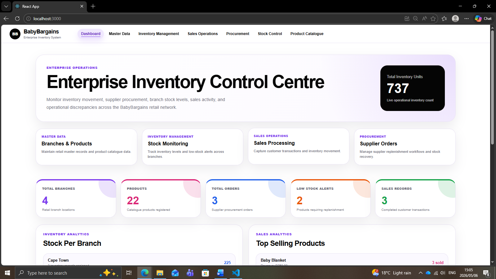
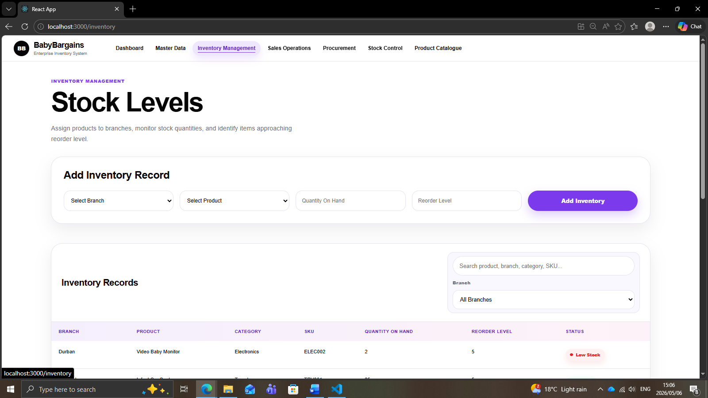
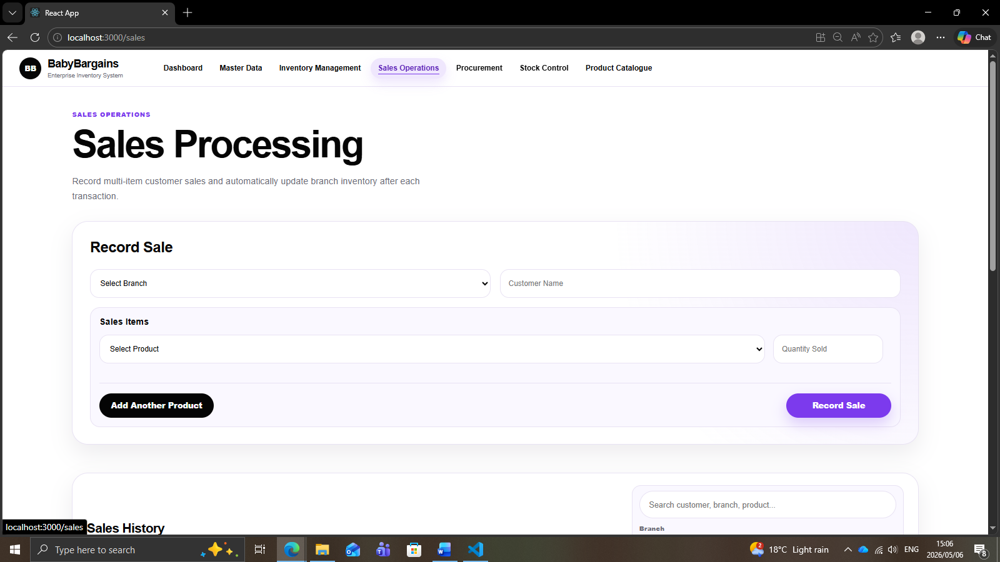
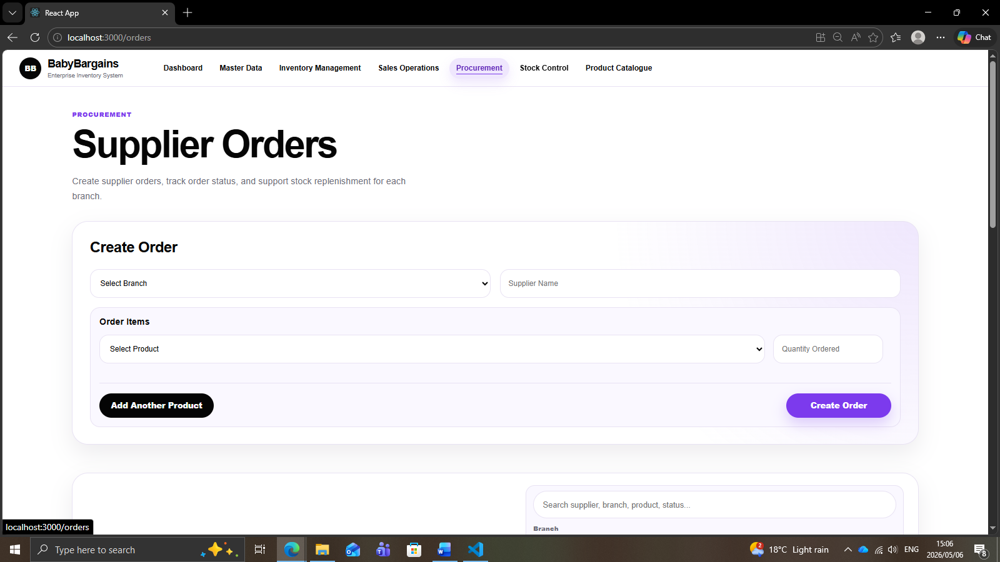
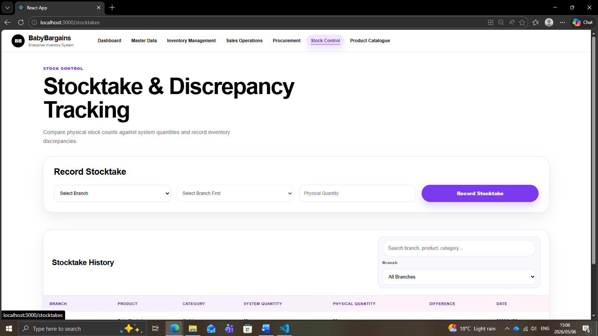

# BabyBargains Enterprise Inventory System

## Overview

BabyBargains is a full-stack enterprise inventory and retail operations management system designed for a fictional baby retail company with multiple branches.

The system was developed to simulate real-world retail business workflows including inventory management, sales processing, supplier procurement, stocktaking, operational analytics, and branch management.

The project follows an enterprise-style modular architecture inspired by ERP systems such as SAP.

---

# Enterprise Modules

## Dashboard
- Enterprise operations overview
- Inventory monitoring
- Sales analytics
- Procurement summaries
- Stock discrepancy visibility
- Low-stock alerts

## Master Data
### Branch Management
- Create and manage retail branches
- Store manager assignments
- Location management

### Product Catalogue
- Centralized product management
- Product categories
- SKU management
- Supplier references
- Product pricing

## Inventory Management
- Assign products to branches
- Monitor stock levels
- Reorder threshold tracking
- Low-stock monitoring
- Inventory visibility across branches

## Sales Operations
- Multi-item sales processing
- Automatic inventory reduction
- Branch-based sales tracking
- Customer transaction recording

## Procurement
- Supplier order management
- Multi-item supplier orders
- Procurement status tracking
- Order lifecycle management

## Stock Control
- Stocktake recording
- Physical vs system quantity comparison
- Inventory discrepancy tracking
- Operational stock auditing

---

# Features

- Full CRUD operations
- Multi-branch inventory support
- Real-time inventory updates
- Multi-item transactions
- Enterprise dashboard
- Search and filtering functionality
- Operational analytics
- Responsive enterprise UI
- Low-stock alerts
- Inventory discrepancy tracking
- Supplier product imports using JSON
- Socket.IO realtime updates

---

# Technology Stack

## Frontend
- React
- React Router
- CSS3
- Axios

## Backend
- Node.js
- Express.js
- MongoDB
- Mongoose
- Socket.IO

---

# System Architecture

The system is divided into enterprise business modules:

```text
Dashboard
│
├── Master Data
│   ├── Branches
│   └── Products
│
├── Inventory Management
│   ├── Stock Levels
│   └── Reorder Monitoring
│
├── Sales Operations
│   ├── Sales Processing
│   └── Sales History
│
├── Procurement
│   ├── Supplier Orders
│   └── Order Tracking
│
└── Stock Control
    ├── Stocktakes
    └── Discrepancy Tracking
```

---

# Key Enterprise Concepts Demonstrated

- ERP-inspired modular architecture
- Multi-branch retail operations
- Inventory lifecycle management
- Procurement workflows
- Transaction processing
- Operational analytics
- Real-time inventory synchronization
- Data consistency across modules

---

# Installation

## Clone Repository

```bash
git clone YOUR_GITHUB_LINK
```

## Backend Setup

```bash
cd server
npm install
npm start
```

## Frontend Setup

```bash
cd client
npm install
npm start
```

---

# Future Improvements

- Authentication and role-based access control
- PDF report generation
- Advanced analytics dashboards
- Forecasting and demand prediction
- Supplier management portal
- Barcode scanning
- Export to Excel/PDF
- AI-powered inventory insights

---

# Screenshots

## Dashboard



## Inventory Management



## Sales Operations



## Orders



## Stock Control



---

# Author

Zipho Renene

Built as a portfolio and enterprise systems project.